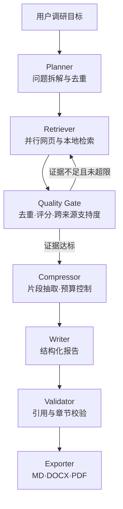

# InsightForge：行业与竞品智能调研报告生成平台

[](https://github.com/sfsfsfsfcsdfsccsdces/industry-research-agent/actions/workflows/test.yml)

一个可直接运行的 AI Agent 项目。项目参考 [GPT Researcher](https://github.com/assafelovic/gpt-researcher) 的 Planner / Execution / Publisher 思路，使用 LangGraph 重新实现了有状态、可回退、可观测的调研工作流，并针对企业行业研究、竞品分析和技术选型场景补充了多源 RAG、来源质量评估、引用校验与报告导出。

> 项目默认启用**演示模式**：没有企业数据、模型 Key 或 Tavily Key 也能跑通全流程。演示资料位于 `data/demo/`，内容明确标注为样例，不会伪装成企业内部数据。

## 1. 能做什么

- 将宽泛调研目标拆成 2—10 个可检索、可验证的子问题，并对问题去重。
- 并发检索 Tavily 网页资料和本地 PDF、Word、Markdown、TXT、CSV 文档。
- 使用 Hash Embedding 生成向量并调用 Chroma 查询，结合关键词匹配、来源可信度和跨来源支持度进行混合重排；Chroma 不可用时自动回退到内存计算。
- 通过 URL 规范化与内容指纹去重，给每条证据分配稳定 `source_id`。
- 按来源抽取高相关证据片段，通过上下文字符预算控制 Writer 输入规模，并保留引用锚点。
- 生成包含执行摘要、竞品对比、机会风险和落地建议的中文报告。
- 校验 `[S1]` 引用是否真实存在，并导出 Markdown、Word 和 PDF。
- 通过 FastAPI + SSE 实时显示 Agent 执行进度，使用 SQLite 保存任务、来源、报告与节点轨迹。
- Redis 不可用时自动降级到进程内缓存；Tavily 请求失败时自动重试并降级到演示语料。

## 2. 核心架构



各层职责：

| 层次 | 实现 | 解决的问题 |
|---|---|---|
| Agent 编排 | LangGraph `StateGraph` | 节点状态传递、条件回路、最大步数保护 |
| 模型调用 | OpenAI-compatible API | 可接 OpenAI 或兼容服务，演示模式使用确定性策略 |
| 网页检索 | Tavily REST API | 实时外部资料，含超时、重试与降级 |
| 本地 RAG | 文档分块 + Hash Embedding + Chroma Query | 无 Key 时仍可执行持久化向量检索；Chroma 异常时回退内存计算 |
| 混合重排 | Vector + Keyword + Credibility + Cross-source support | 跨域关键词统计仅作为辅助信号，不等同于事实级验证 |
| 状态与缓存 | Redis / 内存降级 | 保存高频任务状态，外部依赖故障时可用 |
| 持久化 | SQLite WAL | 任务、来源、Trace、报告可追踪 |
| 服务与交互 | FastAPI + SSE + 原生前端 | 异步任务、实时进度、文件上传与下载 |

## 3. 三分钟启动

要求 Python 3.11+。

```bash
python -m venv .venv
source .venv/bin/activate              # Windows: .venv\Scripts\activate
python -m pip install -e ".[dev]"
cp .env.example .env                   # Windows 可手动复制
python -m uvicorn app.main:app --reload
```

打开 <http://localhost:8000>，直接使用页面中的默认问题开始调研。默认 `DEMO_MODE=true`，无需配置任何 Key。

也可以用命令行跑完整演示：

```bash
python scripts/run_demo.py
```

生成的报告位于 `runtime/reports/<task_id>/`。

## 4. 接入真实搜索与大模型

编辑 `.env`：

```dotenv
DEMO_MODE=false
TAVILY_API_KEY=tvly-xxx
OPENAI_API_KEY=sk-xxx
OPENAI_BASE_URL=https://api.openai.com/v1
OPENAI_MODEL=gpt-4o-mini
```

`OPENAI_BASE_URL` 可换成兼容 `/chat/completions` 协议的服务地址。当前真实模型用于研究规划和报告撰写；离线 Hash Embedding 让项目无需额外 Embedding 费用也可运行。如需线上质量，可在 `app/services/retrieval.py` 中把 `HashEmbedding` 替换为云端或本地语义向量模型，`ChromaVectorIndex` 的接口无需改变。

## 5. Docker 部署

```bash
cp .env.example .env
docker compose up --build
```

Compose 同时启动应用与 Redis，运行数据存入命名卷。访问 <http://localhost:8000>，接口文档位于 <http://localhost:8000/docs>。

## 6. API

| 方法 | 路径 | 用途 |
|---|---|---|
| `POST` | `/api/research` | 创建异步调研任务 |
| `GET` | `/api/research/{id}` | 查询任务和报告 |
| `GET` | `/api/research/{id}/events` | SSE 实时进度 |
| `GET` | `/api/research/{id}/sources` | 查看排序后的证据来源 |
| `GET` | `/api/research/{id}/traces` | 查看节点执行轨迹 |
| `GET` | `/api/research/{id}/download/{md|docx|pdf}` | 下载报告 |
| `POST` | `/api/documents` | 上传本地研究资料 |
| `GET` | `/api/health` | 健康检查与运行模式 |

创建任务示例：

```bash
curl -X POST http://localhost:8000/api/research \
  -H 'Content-Type: application/json' \
  -d '{"query":"对比三个企业知识库方案并给出选型建议","mode":"hybrid"}'
```

## 7. 关键工程问题与解决方案

### 问题一：宽泛问题导致搜索重复、成本失控

Planner 输出结构化子问题，进入图前做稳定去重；质量门只允许在证据不足时回到检索节点，并由 `MAX_RESEARCH_LOOPS` 和 LangGraph `recursion_limit` 双重限制，防止死循环。

### 问题二：资料重复、来源质量参差，模型容易拼接错误结论

先规范化 URL、去除追踪参数，再对正文生成 SHA-256 指纹去重。重排分数综合 Chroma 查询返回的向量相关度、关键词、来源可信度和跨来源支持度；其中跨来源支持度只统计相同关键词覆盖的不同域名，用于辅助复核而非证明来源观点一致。每个来源生成唯一 `source_id`，报告中的引用可反查原文。

### 问题三：长文档直接输入模型导致 Token 过多、关键信息丢失

上传文档和演示语料先按标题、段落及固定长度统一切分，再进入去重、Chroma 索引和混合重排；报告前按来源抽取高相关证据片段，并由 `CONTEXT_CHAR_LIMIT` 控制 Writer 的输入字符预算，同时保留 `source_id` 引用锚点。

### 问题四：外部搜索、模型和 Redis 会超时或不可用

检索使用异步信号量限制并发，对网络失败进行有限重试；Tavily 失败后降级到本地语料。Redis 连接失败自动使用内存缓存，任务主数据仍写入 SQLite，避免缓存故障导致记录丢失。

### 问题五：生成的报告“看起来正确”但引用可能不存在

Validator 提取报告内所有 `[Sx]`，与实际来源集合比对；无效引用替换为“引用待核验”并记录警告。生产环境还应增加数字、时间和实体级 Claim Verification，本项目保留了独立校验节点方便扩展。

## 8. 测试

```bash
pytest -q
ruff check .
```

测试覆盖 URL 规范化与去重、文档加载后统一分块、Chroma 查询接入、混合重排、SQLite 持久化，以及从规划到三格式导出的离线端到端工作流。

## 9. 目录结构

```text
app/
├── api/routes.py          # REST、SSE、上传与下载
├── core/config.py         # 环境配置与路径
├── services/              # 搜索、RAG、质量、报告、缓存、存储
├── workflow/              # LangGraph 状态与节点编排
├── static/index.html      # 可直接演示的前端
└── main.py                # FastAPI 入口
data/demo/                 # 可公开展示的离线样例语料
scripts/run_demo.py        # 命令行端到端演示
tests/                     # 单元与工作流测试
Dockerfile
docker-compose.yml
```
